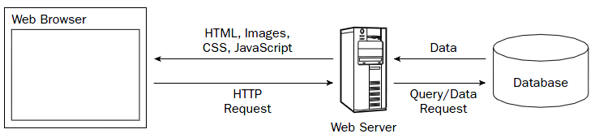
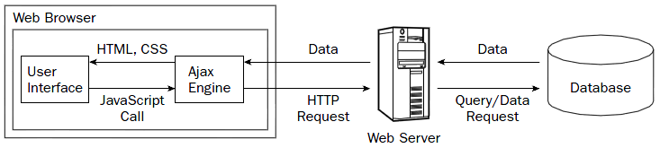

### JS 相关问题：

#### 1、解释下事件代理。

如果要对一个父容器中的几十个 DOM 节点绑定一个事件，可以使用事件代理（event delegation）机制。

#### 2、解释下 JavaScript 中 `this` 是如何工作的。

#### 3、解释下原型继承的原理。

#### 4、你是如何测试 JavaScript 代码的？

一、利用 FireBug 或 Chrome Developer Tool 进行测试。二、使用单元测试工具 QUnit、YUI Test 等。

#### 5、AMD vs. CommonJS？

#### 6、什么是哈希表？

哈希表是一种根据关键字直接访问存储位置的数据结构。如 PHP 中的关联数组、Python 中的字典等，都是属于哈希表结构的数据类型。

#### 7、解释下为什么接下来这段代码不是 IIFE（立即调用的函数表达式）：`function foo(){ }();`。要做哪些改动使它变成 IIFE？

将其改为如下的匿名函数即可实现 IIFE：
```javascript
(function () {
	// code
})();
```
  
#### 8、描述以下变量的区别：`null`，`undefined` 或 `undeclared`？该如何检测它们？
  
#### 9、什么是闭包，如何使用它，为什么要使用它？

闭包就是由函数创造的一个词法作用域，里面创建的变量被引用后，可以在这个词法环境之外自由使用。

闭包通常用来创建内部变量，使得这些变量不能被外部随意修改，同时又可以通过指定的函数接口来操作。

#### 10、请举出一个匿名函数的典型用例？

匿名函数可以用作回调函数执行，如 ``。

此外在 JS 框架中常使用匿名函数来避免全局变量的污染。

#### 11、解释 “JavaScript 模块模式” 以及你在何时使用它。
  * 如果有提到无污染的命名空间，可以考虑加分。
  * 如果你的模块没有自己的命名空间会怎么样？
  
#### 12 你是如何组织自己的代码？是使用模块模式，还是使用经典继承的方法？

#### 13 请指出 JavaScript 宿主对象和原生对象的区别？

何为“宿主对象”？  ECMAScript中的“宿主”当然就是我们网页的运行环境，即“操作系统”和“浏览器”。所有非本地对象都是宿主对象（host object），即由 ECMAScript 实现的宿主环境提供的对象。
所有的BOM和DOM对象都是宿主对象。因为其对于不同的“宿主”环境所展示的内容不同。

#### 14、指出下列代码的区别：
```javascript
function Person(){} 
var person = Person(); 
var person = new Person();
```
第一行是定义了一个函数 `Person`，第二行代码是，第三行代码是用构造函数 `Person()` 构造一个实例对象 `person`。

#### 15、`.call` 和 `.apply` 的区别是什么？

`.call` 的函数原型是 `function.call([thisObj[, arg1[, arg2[, .. [, argN]]]]])`，而 `.apply` 的函数原型则是 `function.apply([thisObj[, argArray]])`。

可以看出，`.apply` 最多只能有两个参数：新对象 `thisObj` 及一个数组 `argArray`，`.call` 则是直接的参数列表。

#### 16、请解释 `Function.prototype.bind` 的作用？

#### 17、你何时优化自己的代码？

#### 18、你能解释一下 JavaScript 中的继承是如何工作的吗？

在 JS 中，继承是通过原型链来实现的。JS 中的每一个对象都有一个原型链，

#### 19、在什么时候你会使用 `document.write()`？
> 大多数生成的广告代码依旧使用 `document.write()`，虽然这种用法会让人很不爽。

#### 20、请指出浏览器特性检测，特性推断和浏览器 UA 字符串嗅探的区别？

#### 21、请尽可能详尽的解释 AJAX 的工作原理。


Ajax 全称为 Asynchronous JavaScript and XML（异步 JavaScript 和 XML），是一种创建交互式网页应用的网页开发技术。
Ajax 的原理简单来说通过 XmlHttpRequest 对象来向服务器发异步请求，从服务器获得数据，然后用 JavaScript来操作 DOM 而更新页面。这其中最关键的一步就是从服务器获得请求数据。

以往我们浏览网页的原理是由 Client 向 Server 提交页面申请，再由 Server 将申请通过 HTTP 传回给 Client 生成浏览页面：



使用 Ajax 后的工作原理如下图，可见通过 Ajax 在用户交互方面有了很大改进，用户可以不用为提交了 Form 而长时间等待服务器应答，而且通过 Ajax 也可以开发出华丽的 Web 交互页面。



#### 22、请解释 JSONP 的工作原理，以及它为什么不是真正的 AJAX。

#### 23、你使用过 JavaScript 模板系统吗？如有使用过，请谈谈你都使用过哪些库，比如 Mustache.js，Handlebars 等等。

#### 24、请解释变量声明提升。

变量提升，就是把变量提升提到函数的顶部位置。需要说明的是，变量提升只是提升变量的声明，并不会把赋值也提升上来。
```javascript
var s = 'Hello World';
(function () {
	// 变量 s 的声明将会提升到这里，值为未定义
    alert(s);
    var s = 'I love you';
})();
```
结果将是 `undefined`。

#### 25、请描述下事件冒泡机制。

#### 26、"attribute" 和 "property" 的区别是什么？

####  为什么扩展 JavaScript 内置对象不是好的做法？

#### 27、请指出 document load 和 document ready 两个事件的区别。

#### 28、`==` 和 `===` 有什么不同？

如果两边的操作数具有相同的类型和值，`===` 返回 `true`，`!==` 返回 `false`。—— JavaScript：语言精粹

然而，当使用 `==` 和 `!=` 时，你可能会遇到类型不同的情况，这种情况下，操作数的类型会被强制转换成一样的再做比较，这可能不是你想要的结果。


#### 29、你如何从浏览器的 URL 中获取查询字符串参数。

#### 30、请解释一下 JavaScript 的同源策略。

#### 31、请描述一下 JavaScript 的继承模式。

#### 32、如何实现下列代码：
```javascript
[1,2,3,4,5].duplicator(); // [1,2,3,4,5,1,2,3,4,5]
```

#### 33、描述一种 JavaScript 中实现 memoization（避免重复运算）的策略。

#### 34、什么是三元表达式？“三元”表示什么意思？

#### 35、函数的参数元是什么？

#### 36、什么是 `"use strict;"` ? 使用它的好处和坏处分别是什么？

`"use strict;"` 将使 JS 代码以严格模式（strict mode）运行。设立"严格模式"的目的，主要有以下几个：

- 消除Javascript语法的一些不合理、不严谨之处，减少一些怪异行为;
- 消除代码运行的一些不安全之处，保证代码运行的安全；
- 提高编译器效率，增加运行速度；
- 为未来新版本的Javascript做好铺垫。

"严格模式"体现了Javascript更合理、更安全、更严谨的发展方向，包括IE 10在内的主流浏览器，都已经支持它，许多大项目已经开始全面拥抱它。
另一方面，同样的代码，在"严格模式"中，可能会有不一样的运行结果；一些在"正常模式"下可以运行的语句，在"严格模式"下将不能运行。

### jQuery 相关问题

#### 1、解释 "chaining"。

Chaining 允许我们在一条语句中允许多个 jQuery 方法（在相同的元素上）。比如下面的代码：

```javascript
$('.button').addClass('dummy')
			.css('color', 'red')
         	.fadeIn('slow');
```

#### 2、解释 "deferreds"。

deferred 是 jQuery 的回调函数解决方案。它解决了如何处理耗时操作的问题，对那些操作提供了更好的控制，以及统一的编程接口。

#### 3、你知道哪些针对 jQuery 的优化方法。

1、尽量使用 CDN 加载（CDN Benefits），在CDN加载失败时，要回源到本地服务器的同版本 jQuery。
2、尽可能在页面底部加载 jQuery 和 JavaScript。
3、一个页面只使用一个 Document Ready，便于调试和跟踪，不要把事件直接写在HTML元素上，这样不方便调试。
4、尽可能的使用 ID 选择器。因为 jQuery 中 ID 选择器使用的是 `document.getElementById()`，所以更快。越靠右侧越具体。
5、缓冲 jQuery 对象；
6、使用链式调用代替变量缓存和多次调用选择器，当链式调用超过 3 级的时候，适当的换行增加可读性。
7、尽量不要把 CSS 混在 JS 中。
8、巧用 `.date()` 方法为节点存储数据
9、使用 `.ajax()`，避免 `.getJson()` 或者 `.get()`，它们在内部也是调用 `.ajax()` 的，并且指定 dataType 属性。
10、不要在 https 的站点上请求 http，使用依赖协议的 URL，不要把数据加在 url 上，使用 data 属性。
11、对于 ajax 加载的内容，使用委托绑定事件，这样可以在元素不存在的时候执行绑定。（之后 ajax 加载进 DOM 结构中）

#### 4、请解释 `.end()` 的用途。

`.end()` 方法结束当前链条中的最近的筛选操作，并将匹配元素集还原为之前的状态。

大多数 jQuery 的遍历方法会操作一个 jQuery 对象实例，并生成一个匹配不同 DOM 元素集的新对象。当发生这种情况时，应该会把新的元素集推入维持在对象中的堆栈内。每次成功的筛选方法调用都会把新元素推入堆栈中。如果我们需要老的元素集，可以使用 `.end()` 从堆栈中弹出新集合。

#### 5、你如何给一个事件处理函数命名空间，为什么要这样做？

#### 6、请说出你可以传递给 jQuery 方法的四种不同值。

选择器（字符串），HTML（字符串），回调函数，HTML 元素，对象，数组，元素数组，jQuery对象等。

#### 7、什么是效果队列？

#### 8、请指出 `.get()`，`[]`，`.eq()` 的区别。

`.eq()` 返回的是一个 jQuery 对象，所以可以使用 jQuery 对象的方法，而 `.get()` 返回一个原生 DOM 对象。

#### 9、请指出 `.bind()`，`.live()` 和 `.delegate()` 的区别。

`.bind()` 直接将事件处理函数绑定到元素上。`.live()` 和 `.delegate()` 则是将事件处理函数绑定到一个特定父元素上，当事件冒泡到这个级时，再对目标元素执行事件处理函数，其中 `.live()` 默认绑定到 `document`。

```javascript
$('a').bind('click', function () { alert('That tickles!') });
$('a').live('click', function () { alert('That tickles!') });
$('.container').delegate('a', 'click', function () { alert('That tickles!') });
```

#### 10、请指出 `$` 和 `$.fn` 的区别，或者说出 `$.fn` 的用途。

首先需要知道的是，`$` 是一个封装好的 jQUery 类，而 `$.fn` 是 `$.prototype` 的简写形式。`$.fn` 常用作给 jQuery 实例扩展方法，在编写 jQuery 插件时使用。

#### 11、请优化选择器：`$(".foo div#bar:eq(0)")`

